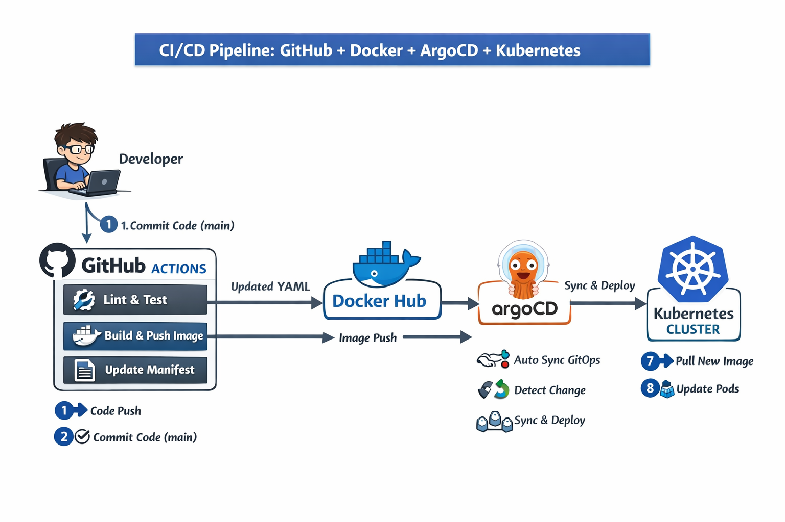

# 🚀 CI/CD Demo – GitHub + Docker + ArgoCD + Kubernetes





This is a simple end-to-end **GitOps CI/CD demo** showing how to:
- ✅ Lint HTML & CSS with GitHub Actions
- ✅ Build & Push Docker image to Docker Hub
- ✅ Automatically update Kubernetes manifests
- ✅ Deploy to Kubernetes using ArgoCD
- ✅ Use GitOps workflow

##

### 🏗 Architecture Overview
1. Developer pushes code to main
2. GitHub Actions:
  - Lint HTML & CSS
  - Build Docker image
  - Push to Docker Hub
  - Update Kubernetes manifest with new image tag
3. Argo CD detects manifest change
4. Kubernetes cluster deploys new version automatically

##

### 📁 Project Structure
```code
.
├── index.html
├── style.css
├── Dockerfile
├── .stylelintrc.json
├── k8s/
│   └── static-site-argocd.yaml
└── .github/workflows/
    └── ci-cd.yml
```

##

### 1️⃣ GitHub Repository Setup
#### 🔹 Step 1 – Create Repository

1. Create new repository in GitHub
   Example: cicd-github-docker-argocd-k8s-demo

2. Push project files

#### 🔹 Step 2 – IMPORTANT: Enable Workflow Permissions ⚠️

You **MUST enable this** or the pipeline cannot push changes.

Go to:
```code
Repository → Settings → Actions → General → Workflow permissions
```
Set:
- #### ✔️ Read and write permissions
- #### ✔️ Allow GitHub Actions to create and approve pull requests

Click **Save**

#### 🔹 Step 3 – Add Docker Hub Secrets

Go to:
```code
Settings → Secrets and variables → Actions → New repository secret
```

Add:

| Secret Name       | Value                     |
--------------------|---------------------------|
| DOCKER_USERNAME   |	your dockerhub username   |
| DOCKER_PASSWORD   |	your dockerhub password   |

##

### 2️⃣ Application Code

**index.html**

```html
<!DOCTYPE html>
<html>
<head>
  <title>My Static Site</title>
  <link rel="stylesheet" href="style.css">
</head>
<body>
  <h1>Hello from Docker + GitHub Actions TEST</h1>
</body>
</html>
```

**style.css**
#### style.css
```css
body {
  background: #f4f4f4;
  text-align: center;
  font-family: Arial, sans-serif;
}
```

#### .stylelintrc.json
```json
{
  "extends": "stylelint-config-standard"
}
```

##

### 3️⃣ Docker Configuration
**Dockerfile**
```dockerfile
FROM nginx:alpine
COPY index.html /usr/share/nginx/html/index.html
COPY style.css /usr/share/nginx/html/style.css
```

Base image:
- Nginx (alpine version)

##

### 4️⃣ GitHub Actions CI/CD Pipeline

File:
```code
.github/workflows/ci-cd.yml
```

**Pipeline Stages**

✅ **Lint Job**
- Runs htmlhint
- Runs stylelint
- Stops infinite loop using `[skip ci]`

✅ **Build & Push Job**
1. Login to Docker Hub
2. Build image tagged with `${{ github.sha }}`
3. Push image
4. Update Kubernetes manifest
5. Commit updated manifest back to main branch

This creates **fully automated GitOps flow.**

##

### 5️⃣ Kubernetes Manifests

File:
```code
k8s/static-site-argocd.yaml
```

Includes:
- Namespace
- Deployment
- Service
- Ingress

**Important Section**
```yaml
image: jozefcvik/static-site-argocd:<commit-sha>
```
⚡ This image tag is automatically replaced by GitHub Actions.

##

### 6️⃣ Kubernetes Cluster Setup

You need:
- Kubernetes cluster (local or cloud)
  - Minikube OR
  - k3s OR
  - Cloud cluster (EKS, AKS, GKE)

##

### 7️⃣ Install ArgoCD
**Step 1 – Add Helm Repo**
```bash
helm repo add argo https://argoproj.github.io/argo-helm
helm repo update
```

**Step 2 – Install ArgoCD**
```bash
helm install argocd argo/argo-cd \
  --namespace argocd \
  --create-namespace \
  --set server.service.type=NodePort \
  --set server.service.nodePort=32000 \
  --set repoServer.resources.requests.cpu=100m \
  --set repoServer.resources.requests.memory=200Mi \
  --set applicationController.resources.requests.cpu=100m \
  --set applicationController.resources.requests.memory=200Mi \
  --set server.resources.requests.cpu=150m \
  --set server.resources.requests.memory=300Mi \
  --set dex.enabled=false
```

This installs:
- Argo CD via Helm

**Step 3 – Get ArgoCD Admin Password**
```code
kubectl -n argocd get secret argocd-initial-admin-secret \
  -o jsonpath="{.data.password}" | base64 -d
```

**Step 4 – Access ArgoCD UI**
```code
http://<NODE-IP>:32000
```

Login:
- Username: admin
- Password: (from previous step)

##

### 8️⃣ Create ArgoCD Application

In ArgoCD UI:

1. Click **NEW APP**
2. Fill:

|Field                |	Value                              |
|---------------------|------------------------------------|
|Application Name	    | static-site                        |
|Project	            | default                            |
|Repo URL	            | your GitHub repo                   |
|Revision	            | main                               |
|Path	                | k8s                                |
|Cluster	            | https://kubernetes.default.svc     |
|Namespace	          | static-site-argocd                 |

Enable:
  ✔️ Auto Sync
  ✔️ Self Heal
  ✔️ Prune

Click **Create**

##

### 9️⃣ How Full CI/CD Flow Works
🔁 **Developer pushes code**

↓

🧪 **GitHub Actions**
- Lint
- Build Docker image
- Push to Docker Hub
- Update manifest
- Commit change

↓

🔄 **ArgoCD**
- Detects change in k8s/
- Syncs automatically

↓

🚀 **Kubernetes**
- Pulls new image
- Deploys new Pod

##

### 🔥 GitOps Flow Explained

This demo implements GitOps principles:
- Git is single source of truth
- No manual kubectl apply
- ArgoCD continuously reconciles state
- Fully automated deployment

##

### 🧪 Test the Pipeline

1. Modify index.html
2. Push to main
3. Watch:
  - GitHub Actions running
  - Docker image created
  - Manifest updated
  - ArgoCD sync
  - Kubernetes rollout
